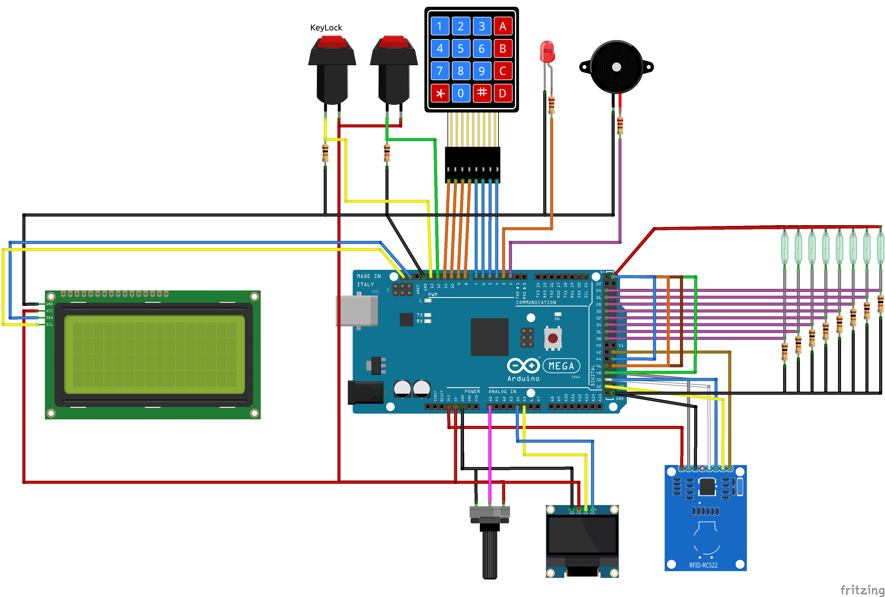

# Composants Fritzing
* [OLED-display](https://forum.fritzing.org/uploads/short-url/uXT2GCSvKpPuyHuJBpZ9dPkq7xz.fzpz)
* [mfrc522](https://fritzing.org/projects/mfrc522)
* [Keypad](https://github.com/brucetsao/Fritzing/blob/master/Keypad%20Membran%204x4.fzpz)
* [LCD2004](https://forum.fritzing.org/uploads/default/original/2X/3/396ac45a9caa834358c9439a959ef2a6203c7a2d.fzpz)

# Librairies
* [Keypad](https://github.com/chris--a/Keypad)
* [Adafruit SSD1306](https://github.com/adafruit/Adafruit_SSD1306)
*	[LiquidCrystal_I2C](https://github.com/marcoschwartz/LiquidCrystal_I2C)
* [mfrc522](https://github.com/miguelbalboa/MFRC522)
